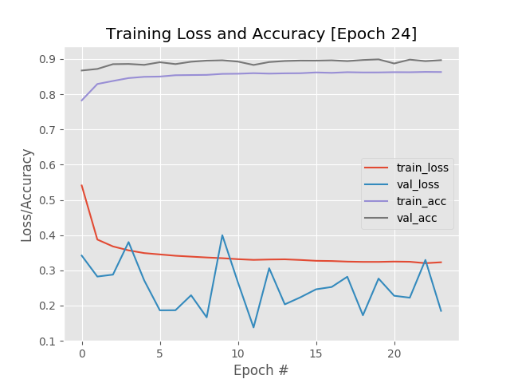
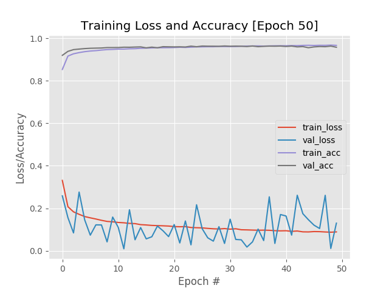
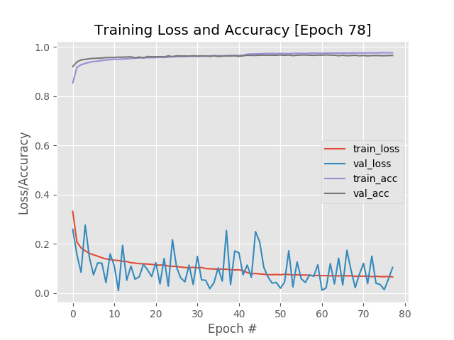
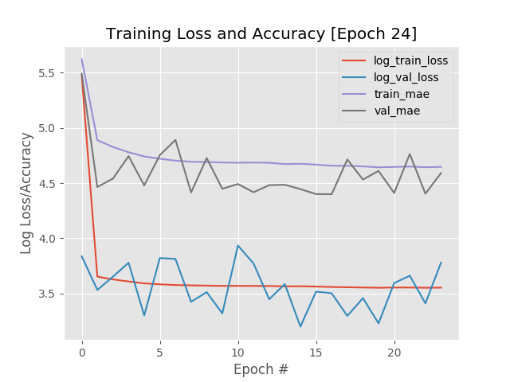
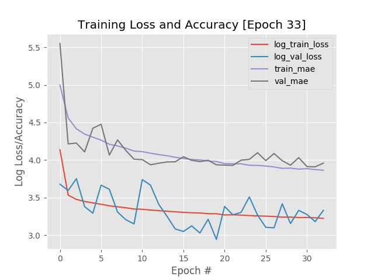
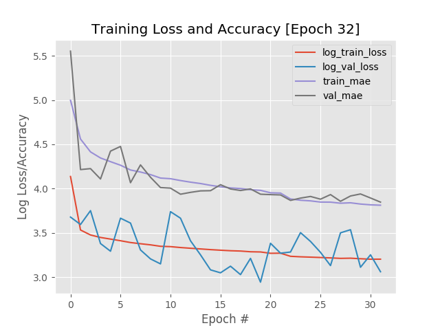

# About

This is a benchmark for gender prediction and age guessing on the [AFAD](https://afad-dataset.github.io/). We used fine-tuning based on the VGG19 architecture (originally trained on the ImageNet dataset) to reach 96.67% accuracy for gender prediction and 3.88 Mean Absolute Error for age guessing.

The resulting model can be used with the AgeEstimatorSharp library, details in the following URL:

https://github.com/duongntbk/AgeEstimatorSharp

**Note**: due to the size of the dataset and the complexity of the network, it is highly recommended to train these models using CUDA enabled GPU. Training on CPU is possible but will take a very long time, measures in days, perhaps weeks.

# Menu

* [About](#about)
* [Install required packages](#install-required-packages)
* [Prepare the AFAD dataset](#prepare-the-afad-dataset)
    - [Downloading the data](#downloading-the-data)
    - [Convert data into hdf5 format](#convert-data-into-hdf5-format)
* [Train gender prediction model](#train-gender-prediction-model)
* [Train age guessing model](#train-age-guessing-model)
* [Convert trained model from h5 to pb](#convert-trained-model-from-h5-to-pb)
* [Where to go from here](#where-to-go-from-here)
* [License](#license)

# Install required packages

On CPU-only machine:

    pip install -r requirements-cpu.txt

On machine with NVIDIA CUDA compatible GPU:

    pip install -r requirements-gpu.txt

# Prepare the AFAD dataset

## Downloading the data

Download the AFAD dataset from the following URL:
https://github.com/afad-dataset/tarball

The tar ball was divided into multiple parts to bypass Github's size limit. Follow the instruction in the link above to unzip the tar ball. The extracted folder tree is as follow:

```
.
data
└── 15
        └── 111
             └── image_0001.png
             └── ...
             └── image_nnnn.png
        └── 112        
             └── image_0001.png
             └── ...
             └── image_nnnn.png
 └── 16
        └── 111
             └── image_0001.png
             └── ...
             └── image_nnnn.png
        └── 112        
             └── image_0001.png
             └── ...
             └── image_nnnn.png

└── ...
└── 70
        └── 111
             └── image_0001.png
             └── ...
             └── image_nnnn.png
        └── 112        
             └── image_0001.png
             └── ...
             └── image_nnnn.png
```

Where *15*, *16*... are the age; and 111 or 112 is gender code, 111 for female and 112 for male.

## Convert data into hdf5 format

Since the AFAD dataset has more than 160,000 images, although it is possible to use Keras's ImageDataGenerator to access those images directly from disk while training, doing so will incurred a massive performance penalty due to all those I/O operations.

Because of that, we will use the *image_to_hdf5.py* script to read data of all images, convert those to tensors and store those tensors in hdf5 format. We will also extract the labels (either age or gender) from file paths.

Hdf5 is a format designed to store and organize large amounts of data, while ensure that accessing those data can be done as fast and efficiently as possible. More info about hdf5 format can be found here:

https://portal.hdfgroup.org/display/HDF5/HDF5

Import the necessary method from *image_to_hdf5*.

    from image_to_hdf5 import write_data_to_hdf5, split_by_gender, split_by_age


To write data with gender labels.

    write_data_to_hdf5(data_dir='data', split_method=split_by_gender, output_dir='hdf5/gender', set_split=0.2, channels_first=False)

To write data with age labels.

    write_data_to_hdf5(data_dir='data', split_method=split_by_age, output_dir='hdf5/age', set_split=0.2, channels_first=False)

- *data_dir*: the folder we extracted AFAD dataset in previous step.
- *split_method*: method used to get labels from file path. 
    - When using *split_by_gender*, all images in folder *111* will be labeled female, while those in folder *112* will be labeled male.
    - When using *split_by_age*, the name of grandparent's folders will be use as labels.
- *output_dir*: target folder to write hdf5 file into.
- *set_split*: the ratio to split dataset into training set, validation set and test set. 
- *channels_first*: whether to place color channel first or last. By default, Keras use channels_last.

**Note**: the gender prediction and the age guessing dataset in hdf5 format take up nearly 80GB combined.

# Train gender prediction model

First, we froze all convolutional layers of VGG19 network, and replaced the few fully connected (FC) layers at the top with our own FC layers. The VGG19 network essentially acted as feature extraction.

The reason we did this is because the VGG19 network has already learned rich, discriminating filters while our FC layers are brand new and totally random. If we allow the gradient to backpropagate from these random values all the way through the body of our network, we risk destroying these powerful features. We performed feature extraction here to give our model a chance to "warm up" first.

Create an object of class GenderModel and use it to create model for feature extraction.

    from keras.applications import VGG19
    from gender_model import GenderModel

    base = VGG19(include_top=False, weights='imagenet', input_shape=(150, 150, 3))
    bm = GenderModel(conv_base=base, num_gpus=2)

- *conv_base*: the pre-trained network to be use as feature extraction (which we will tune in later steps). Aside from VGG19, you can use other pre-trained network, for example: ResNet, InceptionV3...
- *num_gpus*: number of GPU to train model. On CPU only system (which is not recommended), set this value to 0.

By default, generator for training, validation and test dataset are created automatically, with all necessary settings for data augmentation and data preprocessing. However, it is possible to provide your own generator here.

    from hdf5_helper.hdf5_generator import HDF5Generator

    training_generator = HDF5Generator(db_path='my_path/my_training_data.h5', batch_size=32, is_categorical=False, preprocessors=None, augumentator=None)

    bm = GenderModel(conv_base=base, num_gpus=2, training_generator=training_generator)

The code above will create a generator to generate 32 data points from *my_path/my_training_data.h5* every time it is called and perform no preprocessing or data augmetation.

Create Keras model using GenderModel object and start feature extracting. You can leave the learning rate at the default value. The warmup model was trained for 24 epochs.

    model = gm.build_warmup_model(learning_rate=1e-3)
    gm.fit(model=model, name='warmup', epochs=24, start_epochs=0, class_weight=[1.632, 1]) 
    # The ratio of female/male in AFAD dataset is 1/1.632

Every 2 epochs, a checkpoint will be saved to *model/gender*. The result of this step is as follow.

<p align="center">
    
</p>

We can see that our FC layers has already reached nearly 90% accuracy, moreover validation accuracy is higher than training accuracy while validation loss is lower than training loss, this is the clear sign of underfitting. In the next step, we used fine-tuning to increase the model's capacity.

Move all warmup's checkpoint to a different folder.

    mkdir -p model/gender/head
    mv model/gender/*.h5 model/gender/head

Create a model for fine-tuning, based on the result of warmup step.

    model = gm.build_tuning_model(head_path='model/gender/head/epochs_24.h5', trainable_layers=4, learning_rate=5e-4)

- *head_path*: path to model trained in warmup step.
- *trainable_layers*: the number of layers in VGG19 to be unfrozen. Here we will unfreeze the top 4 layers (3 convolutional layers and 1 max pooling layer).
- *learning_rate*: 5e-4 seems to give good result, while higher value, for example 1e-3, will cause the training to not converge.

We performed fine-tuning for 50 epochs.

    gm.fit(model, 'tuning', epochs=50, class_weight=[1.632, 1]))

Every 2 epochs, a checkpoint will be saved to *model/gender*. The result of this step is as follow.

<p align="center">
    
</p>

Our model reached nearly 97% validation accuracy here, and test accuracy reached 96.42%. However, validation loss after epoch 42 varied wildly. We loaded the checkpoint at epoch 42 and restarted training using a lower learning rate.

    import keras.backend as K
    from keras.models import load_model

    model = load_model('model/gender/epochs_42.h5')
    K.set_value(model.optimizer.lr, 1e-4)
    gm.fit(model, 'tuning', epochs=50, start_epochs=42, class_weight=[1.632, 1]))

The result of this step is as follow.

<p align="center">
    
</p>

Accuracy took a small jump when we reduce learning rate, also the validation loss stabilized somewhat. However, around epochs 20 (which is epochs 62 total), we noticed that training accuracy and validation accuracy started to diverge. 

At this epoch, our network reached 96.67% test accuracy, while test loss is only 0.0093. We tried reloading the checkpoint at epoch 62 and reduced learning rate again to 5e-5 but further training proved to be ineffective.

**Conclusion**: after just 24 epochs of warming up and 62 epochs of fine-tuning, we have reached test accuracy of 96.67% for gender prediction task on AFAD dataset.

# Train age guessing model

**Note**: the training process for age guessing is largely the same as the training process of gender prediction. We only include minimal explanation in this section.

Create an object of class AgeModel and use it to create model for feature extraction.

    from keras.applications import VGG19
    from age_model import AgeModel

    base = VGG19(include_top=False, weights='imagenet', input_shape=(150, 150, 3))
    am = AgeModel(conv_base=base, num_gpus=2)

Create Keras model using AgeModel object and start feature extracting. You can leave the learning rate at the default value here and start training for 24 epochs.

    model = am.build_warmup_model(learning_rate=1e-3)
    am.fit(model=model, name='warmup', epochs=24, start_epochs=0) 

Every 2 epochs, a checkpoint will be saved to *model/age*. The result of this step is as follow.

<p align="center">
    
</p>

We can see that both validation mae (Mean Absolute Error) and validation loss are lower than training mae and training loss most of the time. We used the checkpoint at epoch 16 as the base for fine-tuning.

Move all warmup's checkpoint to a different folder.

    mkdir -p model/age/head
    mv model/age/*.h5 model/age/head

Create a model for fine-tuning, based on the result of warmup step. After running experiments, we found out that learning rate equals 1e-3 can still be used to train age guessing model. 
    
    model = am.build_tuning_model(head_path='model/age/head/epochs_16.h5', trainable_layers=4, learning_rate=1e-3)

We performed fine-tuning for 50 epochs.

    am.fit(model, 'tuning', epochs=50)

Every 2 epochs, a checkpoint will be saved to *model/age*. The result of this step is as follow.

<p align="center">
    
</p>

We can see that after epoch 22, validation mae started to overtake training mae, and the gap kept getting bigger. At epoch 22 our test mae is 3.94, while test loss (mean squared error) is 41.057. We reloaded the checkpoint at epoch 22, lowered learning rate to 5e-4 and resumed training.

    import keras.backend as K
    from keras.models import load_model

    model = load_model('model/age/epochs_22.h5')
    K.set_value(model.optimizer.lr, 5e-4)
    am.fit(model, 'tuning', epochs=50, start_epochs=22)

The result of this step is as follow.

<p align="center">
    
</p>

Although not as bad as last time, after just 6 more epochs (epoch 28 total), we can already see that validation mae is quite bigger that training mae. 

At this epoch, our network reached 3.88 test mae, while test loss is 39.78. We tried reloading the checkpoint at epoch 28 and reduced learning rate again to 1e-4 but further training proved to be ineffective.

**Conclusion**: after just 24 epochs of warming up and 28 epochs of fine-tuning, we have reached test mae of 3.88 for age guessing task on AFAD dataset.

# Convert trained model from h5 to pb

In order to use our trained models in AgeEstimatorSharp, we need to convert our models from h5 format to pb format. We can do that using the *to_pb.py* script.

    from to_pb import convert_h5_to_pb
    
    convert_h5_to_pb(h5_path='model/gender/epochs_62.h5', output_dir='model/pb/gender', output_name='epochs_62.pb')

- *h5_path*: path to model in h5 format.
- *output_dir*: folder to save model in pb format.
- *output_name*: name of model in pb format.

# Where to go from here

There are a few things we can try to improve training result:
- Un-freeze more layer in VGG19 network. The top block of VGG19 has 4 convolutional layers and 1 max pooling layer, we've only un-frozen the max pooling layer and 3 out of 4 convolutional layers, not to mention all deeper blocks of VGG19.
- Try tweaking the architecture of our FC layers (add more filters, add more layers, change dropout rate...)
- Test other pre-trained network as base for fine-tuning (ResNet, InceptionV3...)

# License

MIT License

https://opensource.org/licenses/MIT
